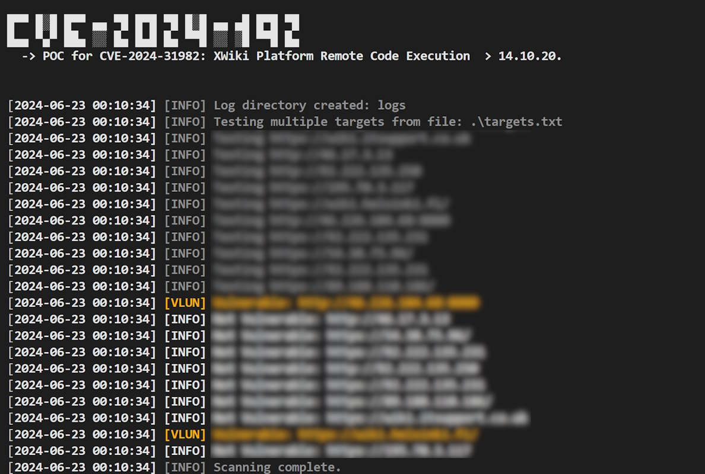

# CVE-2024-31982  PoC and Bulk Scanner




## Overview

POC for CVE-2024-31982: XWiki Platform Remote Code Execution  > 14.10.20. This POC is based on this [security advisory ](https://github.com/xwiki/xwiki-platform/security/advisories/GHSA-2858-8cfx-69m9).


## How to Use

### Single Target Scan

To scan a single target endpoint:
```sh
python CVE-2024-31982.py -u target
```

### Bulk Target Scan
To mass scan bulk targets:
```sh
python cve-2024-31982.py -f targets.txt
```

## Installation

### Minimum Requirements

- Python 3.6 or higher
- `requests` library

### Installing The Script

```sh
git clone https://github.com/bigb0x/CVE-2024-31982.git; cd CVE-2024-31982
```

### Installing Required Packages

Install the required packages using pip:

```sh
pip install requests
```

## Contacts
Get in touch with me if you have any questions or recomendations [M Ali](https://x.com/MohamedNab1l).


## Disclaimer

I like to create my own tools for fun and educational purposes only. I 'm releasing this tool is for educational use only. I do not support or encourage hacking or unauthorized access to any system or network. Please use this tool responsibly and only on systems where you have clear permission to test. You are responsible for any misuse.

## References

- https://github.com/xwiki/xwiki-platform/security/advisories/GHSA-2858-8cfx-69m9
- https://nvd.nist.gov/vuln/detail/CVE-2024-31982
